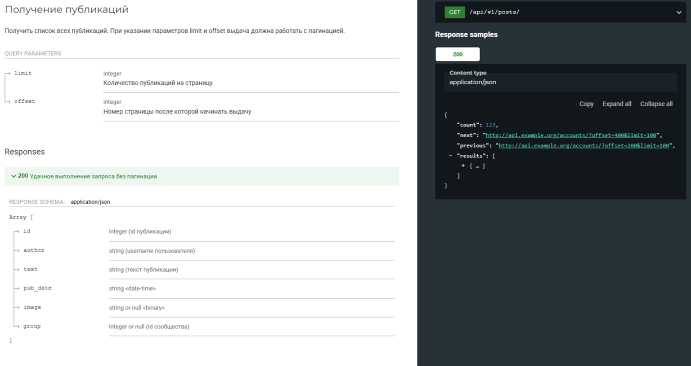
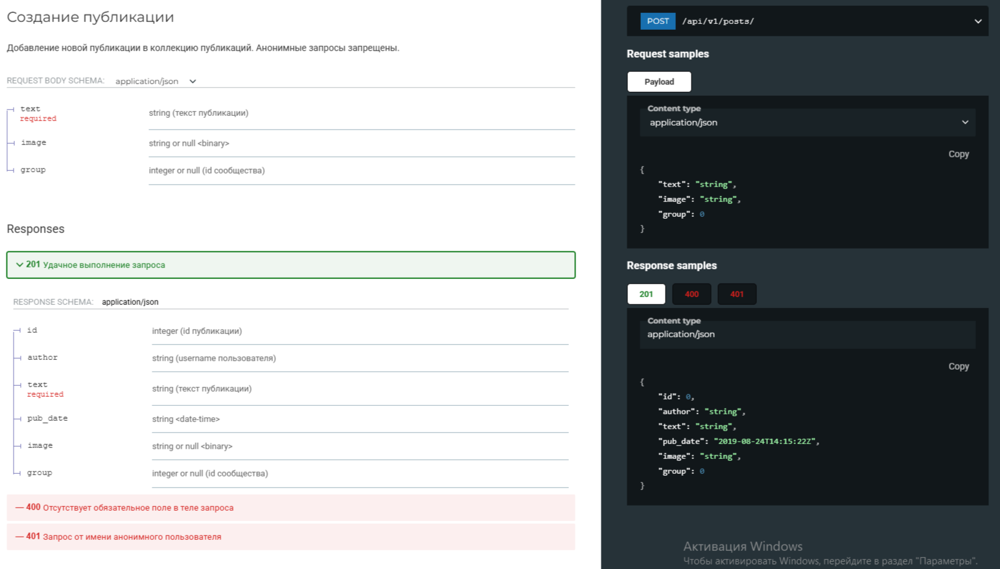
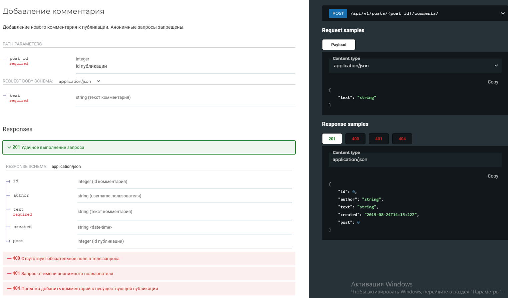
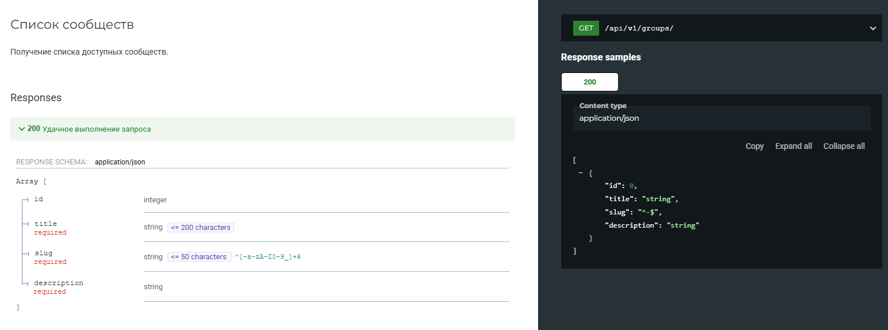
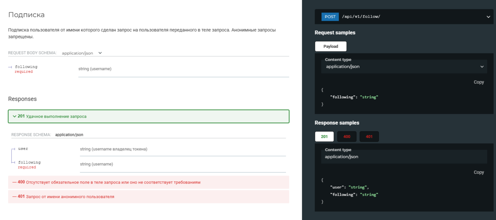

# api_final
api final
# Описание
Данный проект предназначен для обсуждения различных тем между пользователями. Каждый пользователь имеет личный аккаунт, в котором он может публиковать посты. Эти посты могут быть прокомментированы другими пользователями. Также существует возможность подписки на других пользователей, что позволяет следить за постами определенного круга людей.
# Установка
### Как запустить проект:

Клонировать репозиторий и перейти в него в командной строке:

```
git clone https://github.com/Egor213/api_final_yatube.git
```

```
cd yatube_api
```

Cоздать и активировать виртуальное окружение:

```
python3 -m venv env
```

```
source env/bin/activate
```

Установить зависимости из файла requirements.txt:

```
python3 -m pip install --upgrade pip
```

```
pip install -r requirements.txt
```

Выполнить миграции:

```
python3 manage.py migrate
```

Запустить проект:

```
python3 manage.py runserver
```
# Примеры

- **Получения списка всех публикации с возможность указать ограничение и смещение.**



- **Возможность создать пост с заданной картинкой, описанием и заголовком**



- **Возможность создавать комментарии к постам пользователей**



- **Получение списка существующих категории, к которым относятся посты**



- **Подписка на других пользователей**

